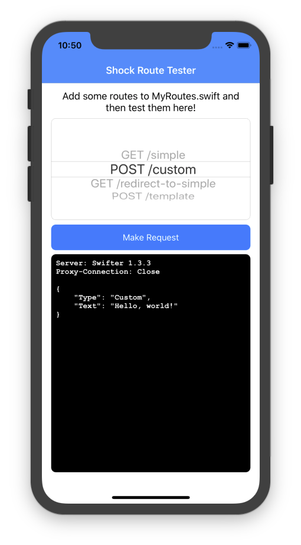

# Shock

[](http://cocoapods.org/pods/Shock)
[](http://cocoapods.org/pods/Shock)
[](http://cocoapods.org/pods/Shock)

A HTTP mocking framework written in Swift.

## Summary

Shock lets you quickly and painlessly provided mock responses for web requests
made by your iOS app.

This is particularly useful for UI tests where you often want to receive
staged responses to allow reliable testing of all of your features.

It also provides an alternative to hitting live APIs and avoids the uncertainty
of receiving unexpected failures or response content as a result.

When used with UI tests, Shock runs its server within the UI test process and
stores all its responses within the UI tests target - so there is no need to
pollute your app target with lots of test data and logic!

## Installation

Add the following to your podfile:

```ruby
pod 'Shock', '~> x.y.z'
```

You can find the latest version in the [releases](releases) tab, or over on
[cocoapods.org](http://cocoapods.org/pods/Shock)

## How does it work?

Shock aims to provide as simple an interface as possible for setting up your
mocks.

Take the example below:

```swift
class HappyPathTests: XCUITestCase {

	// MARK: - Scenario: Log in with non-existing user.

	func testHappyPath() {

		mockServer = MockServer(port: 6789, bundle: Bundle(for: HappyPathTests.self))

		let route = simple(
			method: .GET,
			url: "/my/api/endpoint",
			code: 200,
			filename: "my-test-data.json"
		)

		mockServer.setupRoute(route: route)

		/* ... Your UI test code ... */
	}
}
```

Bear in mind that you will need to replace your API endpoint hostname with
'localhost' and the port you specify in the setup method during test runs.

e.g. ```https://localhost:6789/my/api/endpoint```

This is most quickly accomplished by passing a launch argument to your app that
indicates which endpoint to use. For example:

```swift
let isRunningUITests = ProcessInfo.processInfo.arguments.contains("UITests")
if isRunningUITests {
	apiConfiguration.setHostname("http://localhost:6789/")
}
```

## Shock Route Tester

<p align="center">
	
<p>

The Shock Route Tester example app lets you try out the different route types.
Edit the `MyRoutes.swift` file to add your own and test them in the app.

## Route types

Shock provides different types of mock routes for different circumstances.

### Simple Route

A simple mock is the preferred way of defining a mock route. It responds with
the contents of a JSON file in the test bundle, provided as a filename to the
mock declaration like so:

```swift
let route: MockHTTPRoute = .simple(
	method: .GET,
	url: "/my/api/endpoint",
	code: 200,
	filename: "my-test-data.json"
)
```

### Custom Route

A custom mock allows further customisation of your route definition including
the addition of query string parameters and HTTP headers.

This gives you more control over the finer details of the requests you want your
mock to handle.

Custom routes will try to strictly match your query and header definitions so
ensure that you add custom routes for all variations of these values.

```swift
let route = MockHTTPRoute = .custom(
	method: .GET,
	url: "/my/api/endpoint",
	query: [ "queryKey": "queryValue" ],
	headers: [ "X-Custom-Header": "custom-header-value" ],
	code: 200,
	filename: "my-test-data.json"
)
```

### Redirect Route

Sometimes we simply want our mock to redirect to another URL. The redirect mock
allows you to return a 301 redirect to another URL or endpoint.

```swift
let route: MockHTTPRoute = .redirect(
	.redirect(url: "/source", destination: "/destination")
)
```

### Templated Route

A templated mock allows you to build a mock response for a request at runtime.
It uses [Mustache](https://mustache.github.io/) to allow values to be built in
to your responses when you setup your mocks.

For example, you might want a response to contain an array of items that is
variable size based on the requirements of the test.

Check out the `/template` route in the Shock Route Tester example app for a
more comprehensive example.

```swift
let route = MockHTTPRoute = .template(
	method: .GET,
	url: "/template",
	code: 200,
	filename: "my-templated-data.json",
	data: [
        "list": [ "Item #1", "Item #2" ],
        "text": "text"
    ])
)
```

### Collection

A collection route contains an array of other mock routes. It is simply a
container for storing and organising routes for different tests. In general,
if your test uses more than one route

Collection routes are added recursively, so a given collection route can be
included in another collection route safely.

```swift
let firstRoute: MockHTTPRoute = .simple(method: .GET, url: "/route1", code: 200, filename: "data1.json")
let secondRoute: MockHTTPRoute = .simple(method: .GET, url: "/route2", code: 200, filename: "data2.json")
let collectionRoute: MockHTTPRoute = .collection(routes: [ firstRoute, secondRoute ])
```

## License

Shock is available under Apache License 2.0.
